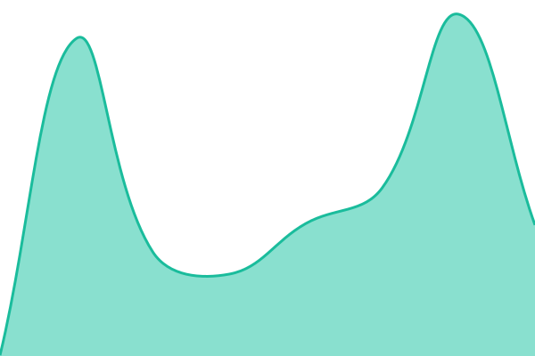
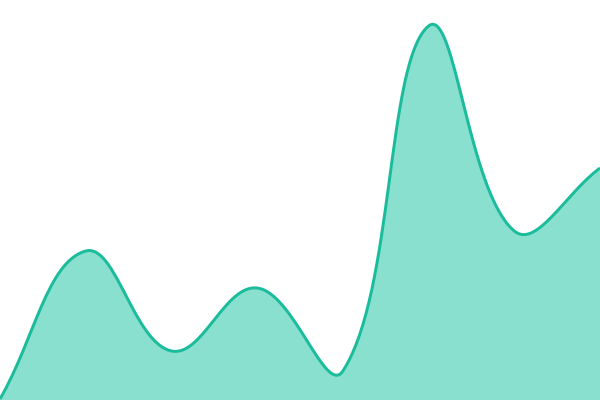
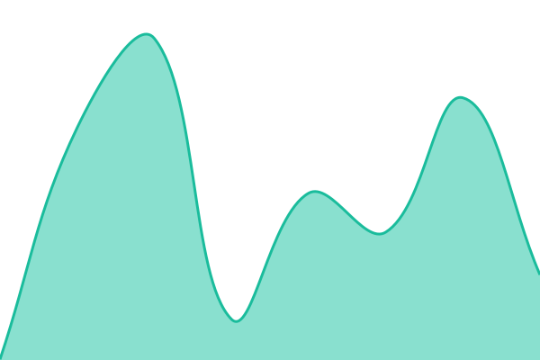
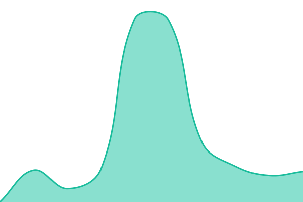

# [📈 État en direct](https://Shamash444.github.io/status): <!--live status--> **🟧 Partial outage**

This repository contains the open-source uptime monitor and status page for [Tony ](https://Shamash444.github.io/status), powered by [Upptime](https://github.com/upptime/upptime).

With [Upptime](https://upptime.js.org), you can get your own unlimited and free uptime monitor and status page, powered entirely by a GitHub repository. We use [Issues](https://github.com/Shamash444/status/issues) as incident reports, [Actions](https://github.com/Shamash444/status/actions) as uptime monitors, and [Pages](https://Shamash444.github.io/status) for the status page.

## [📈 Live Status](https://demo.upptime.js.org): <!--live status--> **🟧 Partial outage**

<!--start: status pages-->
<!-- This summary is generated by Upptime (https://github.com/upptime/upptime) -->
<!-- Do not edit this manually, your changes will be overwritten -->
<!-- prettier-ignore -->
| URL | Status | History | Response Time | Uptime |
| --- | ------ | ------- | ------------- | ------ |
|  [Site Kyneria](https://www.kyneria.com/robots.txt) | Opérationnel | [site-kyneria.yml](https://github.com/Shamash444/status/commits/HEAD/history/site-kyneria.yml) | 

 256ms
     
 | 

<a href="https://Shamash444.github.io/status/history/site-kyneria">100.00%</a>
    

|  [Plan du site (référencement)](https://www.kyneria.com/sitemap.xml) | Opérationnel | [plan-du-site-referencement.yml](https://github.com/Shamash444/status/commits/HEAD/history/plan-du-site-referencement.yml) | 

 186ms
     
 | 

<a href="https://Shamash444.github.io/status/history/plan-du-site-referencement">100.00%</a>
    

|  [Redirection omniasynx.com](https://www.omniasynx.com/robots.txt) | Opérationnel | [redirection-omniasynx-com.yml](https://github.com/Shamash444/status/commits/HEAD/history/redirection-omniasynx-com.yml) | 

 294ms
     
 | 

<a href="https://Shamash444.github.io/status/history/redirection-omniasynx-com">100.00%</a>
    

|  [Base de données](https://ixnaqeysrbrimquvvfqf.supabase.co/functions/v1/health-check) | En panne | [base-de-donnees.yml](https://github.com/Shamash444/status/commits/HEAD/history/base-de-donnees.yml) | 

 2962ms
     
 | 

<a href="https://Shamash444.github.io/status/history/base-de-donnees">97.25%</a>
    

|  [Authentification](https://ixnaqeysrbrimquvvfqf.supabase.co/functions/v1/health-check?check=auth) | En panne | [authentification.yml](https://github.com/Shamash444/status/commits/HEAD/history/authentification.yml) | 

 2366ms
     
 | 

<a href="https://Shamash444.github.io/status/history/authentification">97.25%</a>
    

<!--end: status pages-->

[**Visit our status website →**](https://Shamash444.github.io/status)

## 📄 License

- Powered by: [Upptime](https://github.com/upptime/upptime)
- Code: [MIT](./LICENSE) © [Anand Chowdhary](https://anandchowdhary.com)
- Data in the `./history` directory: [Open Database License](https://opendatacommons.org/licenses/odbl/1-0/)
